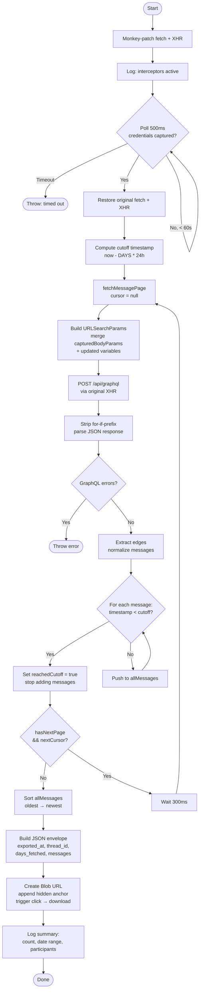

# How the Script Works

The script runs entirely in the browser console without any server-side component. It operates in three distinct phases: **credential capture**, **message pagination**, and **export**.

---

## Phase 1 — Credential Capture

Instagram's DM interface communicates with its backend via GraphQL over HTTP. Each request carries authentication credentials (cookies, CSRF tokens, session headers) that are not directly accessible from JavaScript. The script solves this by monkey-patching the browser's two HTTP mechanisms before any request is made:

- **`window.fetch`** — patched to inspect every outgoing request URL. If the URL contains `/api/graphql`, the request body and headers are passed to `tryCapture()`.
- **`XMLHttpRequest.open/send/setRequestHeader`** — patched similarly to capture XHR-based requests.

`tryCapture()` parses the request body as `URLSearchParams`, extracts the `variables` field (a JSON object), and looks for an `id` property — this is the thread ID. Once found, it stores:

| Captured value | Purpose |
|---|---|
| `capturedThreadId` | Identifies which DM thread to fetch |
| `capturedDocId` | Instagram's internal query identifier |
| `capturedBodyParams` | Full set of form params (includes `fb_dtsg`, `jazoest`, etc.) needed to replay the request |
| `capturedHeaders` | Auth headers (e.g. `x-csrftoken`, `x-ig-app-id`) needed for the request to be accepted |

The script then **polls every 500 ms** until credentials appear (or 60 s elapses). Once captured, all monkey-patches are removed and normal page behaviour resumes.

---

## Phase 2 — Message Pagination

With valid credentials in hand, the script replays the GraphQL query (`IGDMessageListOffMsysQuery`) repeatedly using the **original** (unpatched) XHR to avoid re-triggering the interceptors.

Each page request:
1. Builds a new `URLSearchParams` body by merging `capturedBodyParams` with updated `variables` (including the pagination cursor).
2. Sends a POST to `https://www.instagram.com/api/graphql` with all captured headers.
3. Strips the `for (;;);` anti-hijacking prefix Instagram prepends to responses.
4. Parses the JSON and extracts messages from `data.fetch__SlideThread.as_ig_direct_thread.slide_messages.edges`.

Each message is normalized into a flat object:

```
message_id, sender_name, sender_username, sender_fbid,
text, timestamp_ms, timestamp_iso, content_type,
reactions, replied_to_message_id
```

Pagination continues until one of three conditions is met:
- A message's timestamp falls before the `DAYS` cutoff.
- The response signals `has_next_page: false`.
- No `end_cursor` is returned.

A 300 ms delay is added between pages to reduce the risk of rate limiting.

---

## Phase 3 — Export

All collected messages are sorted oldest → newest by `timestamp_ms`, wrapped in a metadata envelope, serialized to JSON, and downloaded via a programmatically clicked `<a>` element with a `blob:` URL.

---

## Flow Diagram


